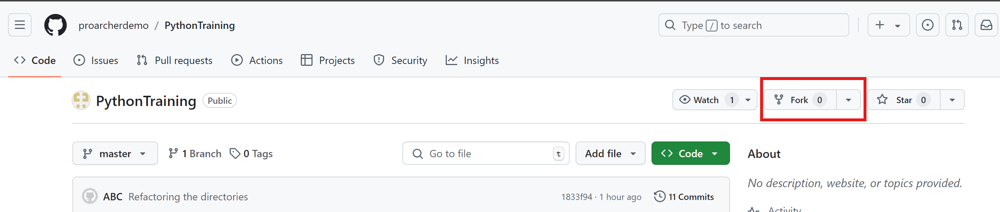

- Fork the repo : https://github.com/proarcherdemo/PythonTraining
- Create directories with your names under the directory "team_works"
- Add your works to the directory you created
- Create a pull request to origin/master

Forking a repo : 

1. On GitHub, navigate to the proarcherdemo/PythonTraining repository.
2. In the top-right corner of the page, click Fork.
   

3. By default, forks are named the same as their upstream repositories. Optionally, to further distinguish your fork, in the "Repository name" field, type a name.
4. Click <b> Create A New Fork </b>